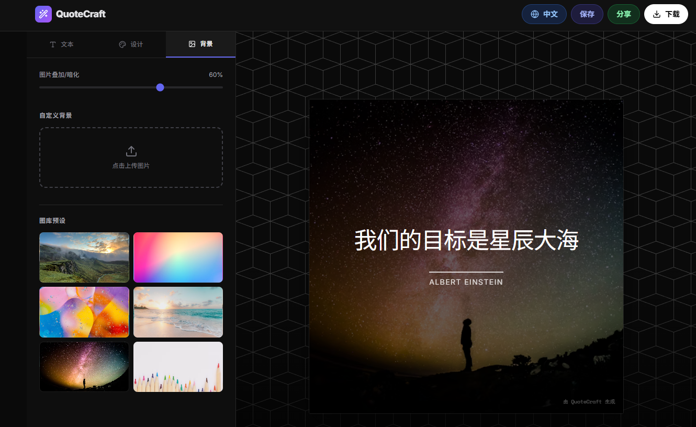

# QuoteCraft


> 中文 / English

## 示例预览 / Preview
  <picture>
    <source type="image/png" srcset="./assets/preview.png">
    
  </picture>

## 体验地址 / Live Demo

- [QuoteCraft 体验地址](https://quote-craft-eight.vercel.app/)

## 示例预览 / Preview

## 项目概述 / Overview
- 中文：QuoteCraft 是一个简洁高效的文字卡片创作工具，帮助你快速生成适合社交媒体、博客、演示等场景的精美文字卡片。提供多主题、字体、背景与布局选项。
- English: QuoteCraft is a clean and efficient quote card creator for social media, blogs, and presentations. It offers themes, fonts, backgrounds, and layout options.

## 技术栈 / Tech Stack
- React 19.2.0
- TypeScript 5.8.2
- Vite 6.4.1
- Tailwind CSS
- lucide-react (icons)
- clsx (classnames)
- html-to-image (export PNG)

## 安装与启动 / Install & Run
- 前置条件 / Prerequisites: Node.js 18+ and npm/yarn
1. 克隆 / Clone
   ```bash
   git clone <repository-url>
   cd QuoteCraft
   ```
2. 安装依赖 / Install dependencies
   ```bash
   npm install
   ```
3. 启动开发服务器 / Start dev server
   ```bash
   npm run dev
   ```
4. 访问应用 / Open in browser
   - http://localhost:3000

## 使用说明 / Usage
### 1) 输入内容 / Enter Text
- 中文：在 “Message” 输入引用内容；在 “Author / Attribution” 输入作者或署名；可选勾选 “Include Date”。
- English: Type your quote in “Message”, author in “Author / Attribution”, optionally check “Include Date”.

### 2) 设计样式 / Design
- 中文：选择主题与字体，调整文字大小与对齐，自定义文本颜色，选择画布比例（1:1、3:4、9:16、16:9）。
- English: Pick theme and font, adjust size and alignment, set text color, choose ratio (1:1, 3:4, 9:16, 16:9).

### 3) 设置背景 / Background
- 中文：从预设图库选择或上传图片，调节叠加层透明度以提升可读性。
- English: Use gallery presets or upload your image; tune overlay opacity for readability.

### 4) 导出与分享 / Export & Share
- 中文：点击右上角 “Download” 导出 PNG；使用分享菜单复制链接或跳转社交平台。
- English: Click “Download” to export PNG; use the share menu to copy link or open social platforms.

## 多语言支持 / Internationalization
- 中文：内置中文与英文，通过头部的语言切换组件使用。文案位于 `i18n/locales/zh.json` 与 `i18n/locales/en.json`，可根据需要扩展更多语言。
- English: Built-in Chinese and English via the header language switcher. Text resources live in `i18n/locales/zh.json` and `i18n/locales/en.json`; more languages can be added.

### 添加新语言 / Add a New Language
- 中文：
  - 在 `i18n/locales/` 目录新增 `<lang>.json`（参考现有键结构）。
  - 在 i18n 初始化处注册新语言资源（保持同键名）。
  - 界面复用相同的 `t('...')` 键。
- English:
  - Create `i18n/locales/<lang>.json` following existing key structure.
  - Register the new language in the i18n initialization with matching keys.
  - Reuse the same `t('...')` keys in UI.

## 功能特性 / Features
- 文本编辑与署名展示 / Text editing and attribution
- 主题、字体、颜色与布局定制 / Themes, fonts, colors, layout
- 背景上传与图库预设 / Background upload and presets
- 叠加层透明度调节 / Overlay opacity tuning
- 多画布比例 / Multiple canvas ratios
- 高分辨率 PNG 导出 / High-resolution PNG export
- 本地保存与加载配置 / Local save & load configs (via `localStorage`)

## 配置说明 / Configuration
- 中文：当前版本不需要环境变量即可运行；如需自定义主题或字体，可在 `tailwind.config.js` 与 `index.html` 配置。
- English: No env vars required; extend themes in `tailwind.config.js` and fonts in `index.html`.

## 项目结构 / Project Structure
```
QuoteCraft/
├── components/          # 组件 / Components
│   └── CardPreview.tsx  # 预览 / Preview
├── services/            # 服务层（可扩展）/ Services (extensible)
├── types.ts             # 类型定义 / TypeScript types
├── App.tsx              # 主应用 / Main app
├── index.html           # HTML 入口 / HTML entry
├── package.json         # 项目配置 / Package config
├── tsconfig.json        # TS 配置 / TS config
├── vite.config.ts       # Vite 配置 / Vite config
└── README.md            # 文档 / Docs
```


---

让引用卡片创作变得简单而优雅！ / Craft quote cards simply and elegantly.
